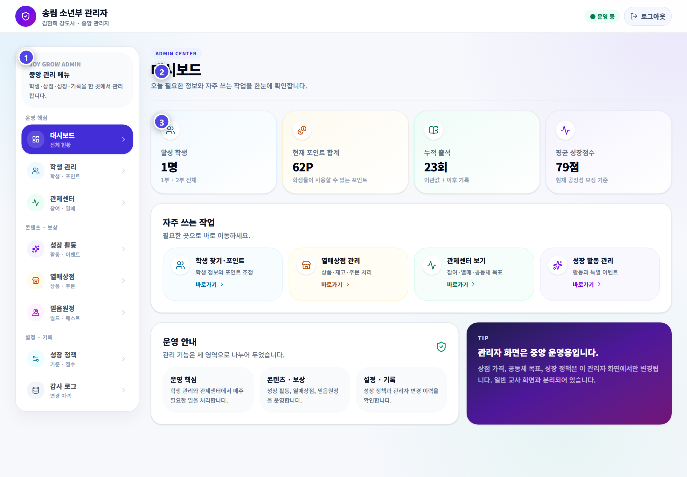

# 관리자 사용법

관리자는 출석부 통제센터와 JoyGrow 독립 관리자를 목적에 맞게 나누어 사용합니다.

## 두 관리 화면의 차이

| 화면 | 주요 업무 |
|---|---|
| 출석부 `JoyGrow 통제센터` | 1·2부 현황, GPT 일괄 입력, 교사 지급 기록, 빠른 설정 |
| JoyGrow 독립 관리자 | 학생·포인트·상점·성경 인물·믿음 원정대·정책·감사 기록 |

## 매주 확인할 것

- 시작·종료 이벤트와 연결 오류
- 새 학생, 반 이동, 복귀 학생의 명단
- 교사 지급 로그와 비정상 중복
- 포인트 상점의 재고와 수령 대기 주문
- 끝난 이벤트의 비활성화 상태

## 안전 원칙

1. 이름뿐 아니라 부서와 반을 확인합니다.
2. 포인트와 정책 변경에는 이유를 남깁니다.
3. 일괄 입력은 저장 전에 사람이 검토합니다.
4. 상품을 전달한 뒤에만 수령 완료로 처리합니다.
5. 예상하지 못한 결과는 감사 로그에서 확인합니다.

> 전체 포인트 조정과 최종 운영은 김환희 강도사가 담당합니다.
