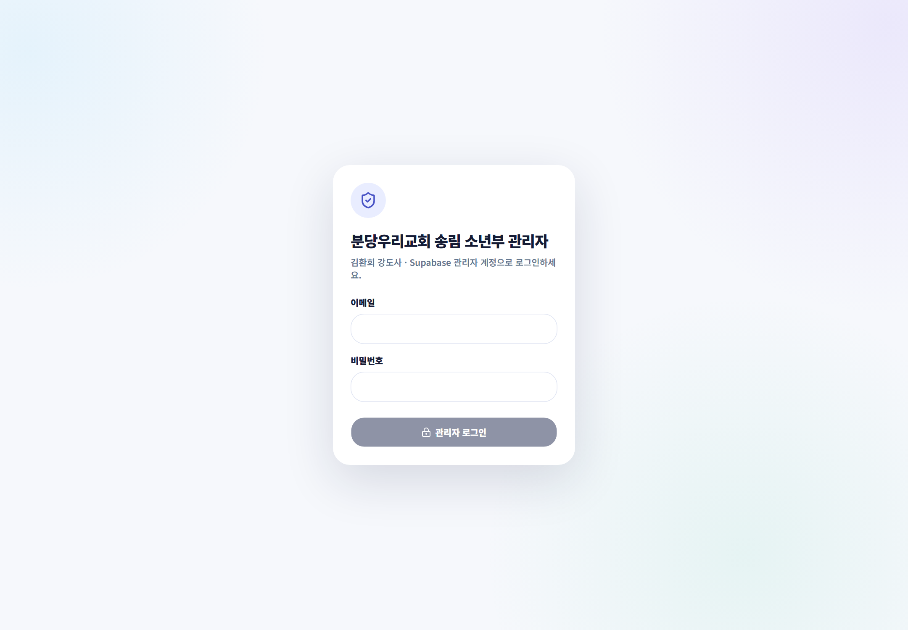

# 관리자 시작하기

관리자는 두 화면을 목적에 맞게 나누어 사용합니다. 모든 변경 작업의 최종 담당자는 김환희 강도사입니다.

## 어떤 화면을 사용하나요?

| 화면 | 주로 하는 일 |
|---|---|
| 출석부 `JoyGrow 통제센터` | 1·2부 운영 현황, 랭킹, GPT 일괄 입력, 교사 지급 로그, 빠른 설정 |
| JoyGrow 독립 관리자 | 학생·포인트·포인트 상점·성경 인물·믿음 원정대·성장 정책·감사 로그 |

## 안전한 작업 원칙

1. 검색 결과에서 이름뿐 아니라 부서와 반을 확인합니다.
2. 포인트와 정책을 바꿀 때는 이유와 적용 시점을 먼저 정합니다.
3. 일괄 입력 결과는 저장 전 학생·항목·숫자를 사람이 검토합니다.
4. 상점 상품을 전달한 뒤에만 `수령 완료`로 처리합니다.
5. 예상하지 못한 결과는 감사 로그와 지급 기록에서 확인합니다.

> **기억하세요**  
> 운영 데이터를 설명서나 공개 대화방에 복사하지 마세요. 학생 이름, 연락처, 비밀번호와 상담 내용은 외부에 공개하지 않습니다.
