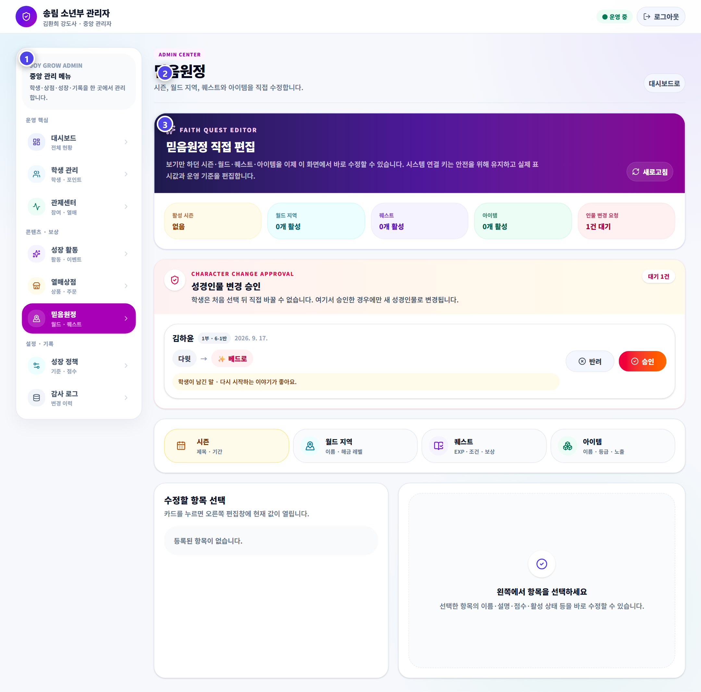

# 성경 인물 변경 승인

주인공이 보낸 성경 인물 변경 요청을 확인해 승인하거나 반려합니다.

## 이렇게 처리하세요

1. 대기 중인 요청을 엽니다.
2. 학생의 이름·부서·반과 현재 인물을 확인합니다.
3. 요청한 인물과 학생이 남긴 이유를 읽습니다.
4. 변경에 따른 성장 기록 영향을 확인합니다.
5. 승인 또는 반려하고 결과를 다시 확인합니다.

## 선택만 다시 해야 하는 경우

출석부 `JoyGrow 통제센터`의 캐릭터 선택 초기화는 현재 포인트와 EXP를 유지하고 선택 상태만 초기화할 때 사용합니다. 학생 전체 기록 삭제와는 다릅니다.

> **기억하세요**  
> 반복 변경을 쉽게 허용하지 말고, 학생이 충분히 생각해 고를 수 있도록 안내하세요.
