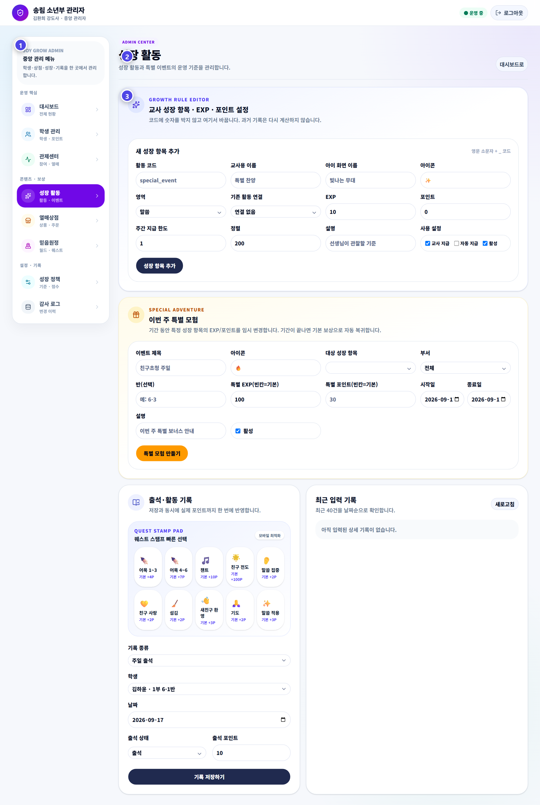

# 성장 활동과 이벤트

포인트·EXP를 주는 활동과 특정 기간의 특별 보너스를 관리합니다.

## 성장 활동

각 항목에는 선생님용 이름, 학생용 이름, 설명, 포인트, EXP, 주간 한도, 활성 상태가 있습니다. 화면에 없는 새 항목을 설명서만 보고 임의로 만들지 않습니다.

## 특별 이벤트

1. 이벤트 이름과 설명을 씁니다.
2. 적용할 활동과 포인트·EXP 값을 확인합니다.
3. 시작일과 종료일을 정확히 지정합니다.
4. 저장 후 학생과 선생님 화면에 올바르게 표시되는지 확인합니다.
5. 기간이 끝난 이벤트가 계속 활성화되어 있지 않은지 확인합니다.

## 변경 전 체크

- 현재 진행 중인 주간 기록에 미치는 영향
- 교사 화면의 지급 버튼과 제한
- 학생 화면의 퀘스트와 포인트 안내
- 설명서의 포인트 기준표 갱신 필요 여부

> **기억하세요**  
> 운영 중 점수 기준을 바꾸면 선생님과 학생이 혼란스러울 수 있습니다. 변경 이유와 시작일을 먼저 공유하세요.
