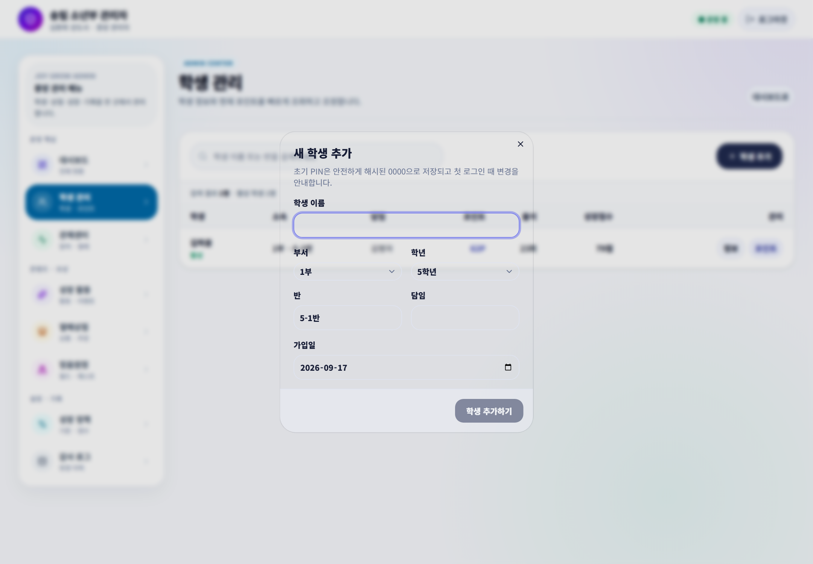
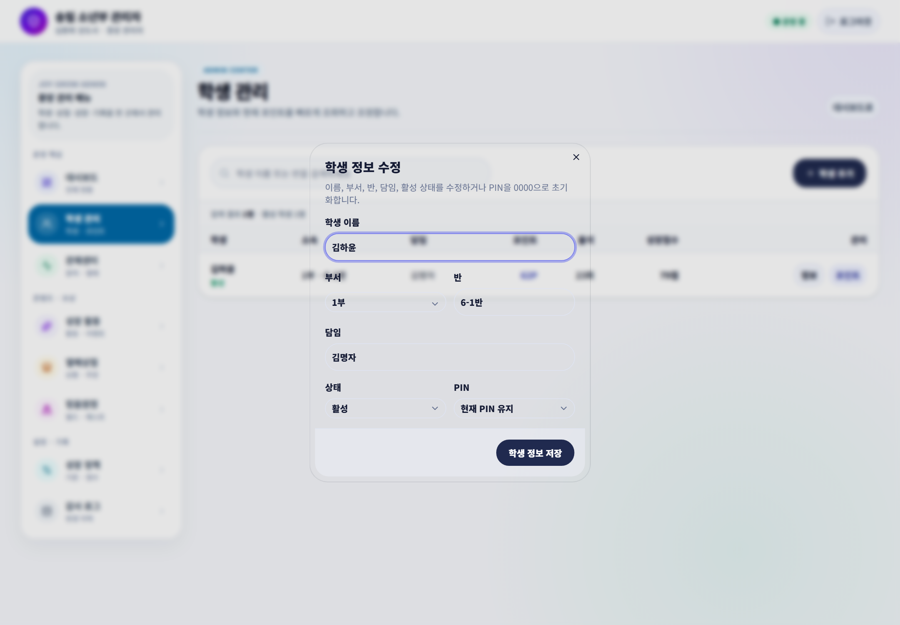
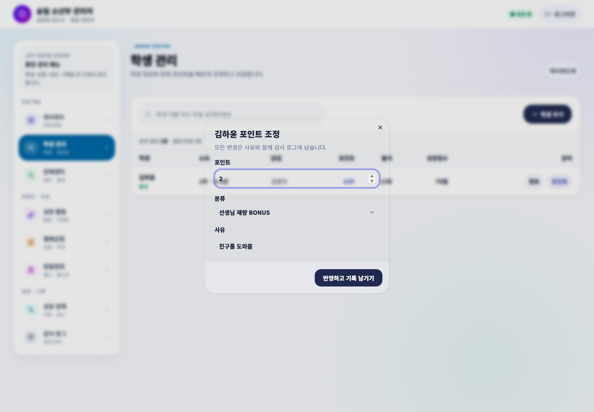

# 학생 관리와 포인트

학생을 검색해 기본 정보와 현재 포인트·EXP·성경 인물을 확인하고 필요한 값을 조정합니다.

## 학생 추가와 수정

1. `학생 관리`에서 이름을 검색합니다.
2. 같은 이름이 있는지 부서와 반까지 확인합니다.
3. 새 학생이면 추가하고, 기존 학생이면 정보 수정을 엽니다.
4. 저장 뒤 출석부 명단과 JoyGrow의 부서·반이 맞는지 확인합니다.

## 포인트 조정

1. 대상 학생의 이름·부서·반을 다시 확인합니다.
2. 포인트 조정 창을 엽니다.
3. 지급은 양수, 차감은 허용된 범위의 음수로 입력합니다.
4. 누가 봐도 알 수 있는 짧은 사유를 남기고 저장합니다.
5. 포인트가 0보다 작아지지 않았는지 확인합니다.

> **기억하세요**  
> 포인트 전체 조정은 김환희 강도사가 담당합니다. 선생님의 잘못 지급은 가능한 경우 최근 지급 취소 기능을 먼저 사용합니다.
