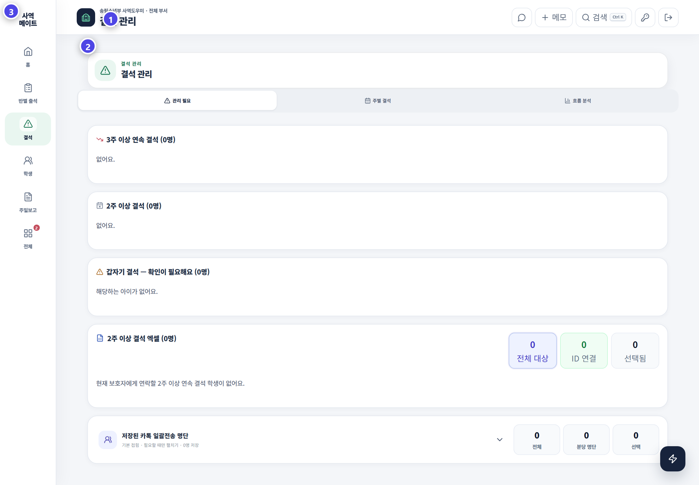

# 송림소년부 출석부 사용 가이드

송림소년부 출석부는 선생님이 예배를 준비하고, 학생의 출결을 기록하고, 만나지 못한 아이를 돌보도록 돕습니다. 홈에서는 전체 공지와 월간 사역계획도 확인할 수 있습니다. 관리자에게는 반·계정·보고·목양·JoyGrow 연결을 운영하는 도구가 더 보입니다.

처음이라면 [접속·설치](../getting-started/install.md) → [선생님 사용법](teacher-guide.md) → [주일 출석 기록](attendance.md) 순서로 읽으세요. 운영 담당자는 [관리자 시작하기](../admin/README.md)와 아래 상세 기능을 이어서 읽으면 됩니다. 화면에 보이는 메뉴는 계정 권한에 따라 다릅니다.

## 이 설명서의 화면 표시

화면 이미지의 보라색 번호는 모든 페이지에서 같은 기준으로 읽습니다.

| 번호 | 뜻 |
|---:|---|
| ① | 지금 열어 둔 화면의 이름과 상단 작업 버튼 |
| ② | 실제로 확인하고 입력하는 업무 영역 |
| ③ | 역할에 맞는 홈·출석·결석·주일보고 등의 메뉴 이동 |

## 선생님의 기본 흐름

`홈 공지·월간계획 확인 → 우리 반 출석 기록 → 결석 사유 확인 → 필요한 목양 요청 → JoyGrow 칭찬`

칭찬 지원 선생님은 담당 반 출석 대신 [칭찬 화면 사용법](../teacher/support-teacher.md)을 읽으세요.

## 관리자의 운영 흐름

`주일 준비 → 출석 확인 → 결석 사유 → 목양 행동 → 주일보고 → 데이터 점검`

| 흐름 | 할 일 |
|---|---|
| 주일 준비 | 이번 주에 나와야 할 학생 명단 확인 |
| 출석 기록 | 실제로 만난 학생과 만나지 못한 학생 구분 |
| 결석 관리 | 사유 누락·연속 결석·장결 학생 확인 |
| 목양 연결 | 연락·기도·심방·다음 약속 기록 |
| 운영 마감 | 주일보고를 저장하고 미체크 반 확인 |
| 안전 관리 | 권한·백업·데이터 정합성과 휴지통 확인 |

> 결석을 빨리 알아차리고 다시 만날 길을 준비하는 것이 출석 기록의 목적입니다.
