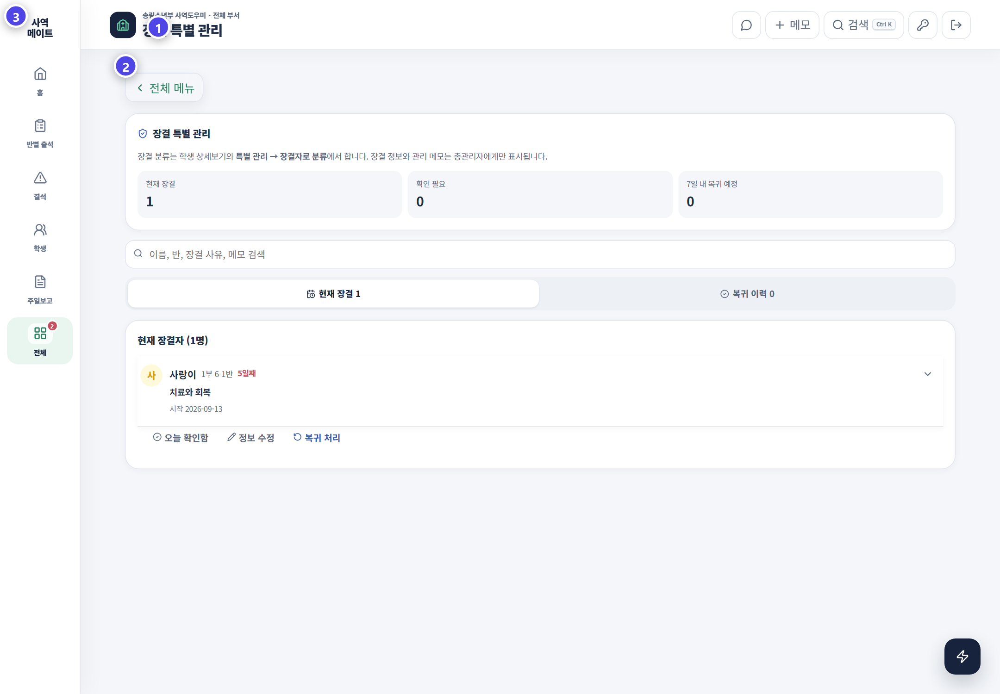

# 결석과 장결 관리 · 목양의 시작

결석과 장결 관리는 출석부의 중심 기능입니다. 선생님이 이번 주에 만나야 할 아이를 알고 실제로 만나지 못한 아이를 빠르게 찾도록 돕습니다. 확인한 내용은 연락·기도·심방으로 이어집니다.

## 선생님이 이 화면에서 확인할 것

| 상태 | 뜻 | 선생님의 다음 행동 |
|---|---|---|
| 미체크 | 아직 출석 여부가 확인되지 않음 | 출석 여부부터 확인 |
| 사유 없음 | 결석했지만 이유가 기록되지 않음 | 학생이나 보호자에게 안부 확인 |
| 예정 결석 | 미리 알려진 일정이 있음 | 기간과 복귀 예정일 확인 |
| 갑작스러운 결석 | 평소 나오던 학생이 이번 주에 보이지 않음 | 당일 또는 주중에 연락 |
| 2주 연속 결석 | 다시 살펴야 할 단계 | 이전 연락 내용 확인 후 재연락 |
| 3주 이상 결석 | 집중 목양이 필요한 단계 | 담당자와 목양 계획 결정 |
| 장결 | 오랜 기간 출석이 어려움 | 정기 연락과 복귀 계획 관리 |

## 결석 관리의 세 탭

| 탭 | 선생님이 보는 내용 | 사용 방법 |
|---|---|---|
| 관리 필요 | 2주·3주 연속 결석과 갑작스러운 결석 | 먼저 연락할 학생 결정 |
| 주별 결석 | 선택한 주일의 결석 학생과 사유 | 빠진 사유 보완 |
| 흐름 분석 | 학생별 출석 변화 | 평소와 달라진 흐름 발견 |

## 주일마다 확인하는 순서

1. **반별 출석**에서 미체크 학생을 먼저 확인합니다.
2. **결석**에서 이번 주에 만나지 못한 학생을 봅니다.
3. 예정 결석인지 갑작스러운 결석인지 구분합니다.
4. 기록된 사유와 이전 연락 내용을 확인합니다.
5. 연락이 필요한 학생과 담당 선생님을 정합니다.
6. 연락 결과와 다음 약속을 남깁니다.
7. 반복 결석은 장결 관리나 목양센터로 연결합니다.

## 누가 나와야 하는지 확인하는 기준

현재 반에 등록되어 있고 출석 대상인 학생이 기본 명단에 표시됩니다. 예정 결석과 장결 학생은 상태를 따로 보여 줍니다. 선생님은 명단에서 빠진 학생이 없는지 먼저 확인해야 합니다.

- 새로 등록한 학생이 반 명단에 보이는지 확인합니다.
- 반을 이동한 학생은 새 반에 표시되는지 확인합니다.
- 장결 학생은 출석 불가 상태와 목양 상태를 함께 확인합니다.
- 복귀한 학생은 장결 상태를 종료하고 출석 명단을 확인합니다.

## 보호자 연락 명단

카톡 일괄전송 명단은 연락이 필요한 학생을 모아 줍니다. 발송 전에는 학생 이름과 연락처와 문장을 확인합니다. 이미 연락한 학생은 중복 연락이 가지 않도록 기록을 먼저 봅니다.

## 장결 특별 관리

1. 학생과 현재 반을 확인합니다.
2. 시작일과 사유를 입력합니다.
3. 다음 연락일을 정합니다.
4. 담당 선생님이 오늘 확인했는지 표시합니다.
5. 연락 결과와 다음 목양 행동을 남깁니다.
6. 학생이 돌아오면 복귀일을 기록합니다.
7. 장결 상태를 종료한 뒤 출석 명단을 확인합니다.

## 좋은 결석 기록의 기준

| 기록 | 예시 |
|---|---|
| 확인한 사실 | 이번 주 가족 일정으로 결석 |
| 연락한 사람 | 담당 선생님이 보호자에게 연락 |
| 확인 날짜 | 9월 17일 확인 |
| 다음 행동 | 다음 주 복귀 여부 확인 |
| 담당자 | 6-1반 담당 선생님 |

> 결석한 아이를 빨리 발견하고 다시 만날 준비를 하는 일이 목양의 시작입니다.
