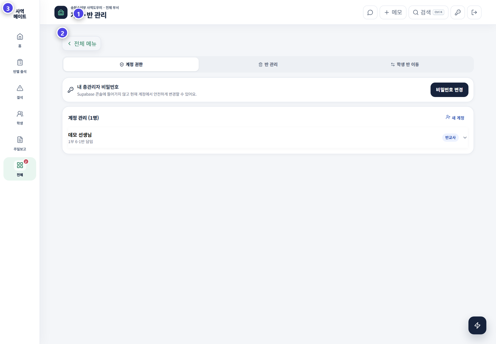
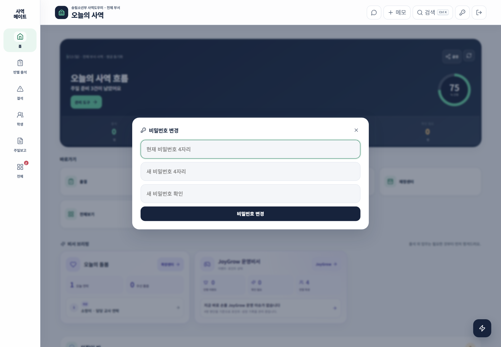

# 계정과 권한

계정·반 화면에서는 사용자 역할, 담당 반, 예배 범위와 학생 이동을 관리합니다.

## 권한 구분

| 권한 | 사용 범위 |
|---|---|
| 최고 관리자 | 모든 화면, 계정·반·연동·휴지통과 제출 관리 |
| 부관리자 | 허용된 관리자 기능과 출석 운영 |
| 읽기 전용 관리자 | 전체 자료 조회, 저장·수정·삭제 차단 |
| 교사 | 담당 반 중심의 출석·통계·JoyGrow 기능 |
| 지원 교사 | 배정된 예배 범위에서 필요한 지원 기능 |

## 계정을 만들 때

1. 같은 아이디나 사용자가 이미 있는지 확인합니다.
2. 표시 이름과 역할을 선택합니다.
3. 교사는 담당 반을, 지원 인력은 예배 범위를 연결합니다.
4. 필요한 최소 권한만 부여합니다.
5. 새 계정으로 로그인해 보이는 메뉴를 확인합니다.

## 개인 계정 설정

상단 열쇠 버튼에서 현재 계정과 비밀번호를 관리합니다. 공용 비밀번호를 여러 사람이 공유하지 말고, 역할이 끝난 계정은 즉시 비활성화하거나 삭제합니다.

## 메뉴가 보이지 않을 때

읽기 전용, 담당 반, 예배 범위와 관리자 등급을 먼저 확인합니다. 최고 관리자 전용 도구가 일반 관리자에게 표시되지 않는 것은 정상입니다.

> 편의를 위해 높은 권한을 주기보다 맡은 일에 맞는 권한을 주는 것이 안전합니다.
