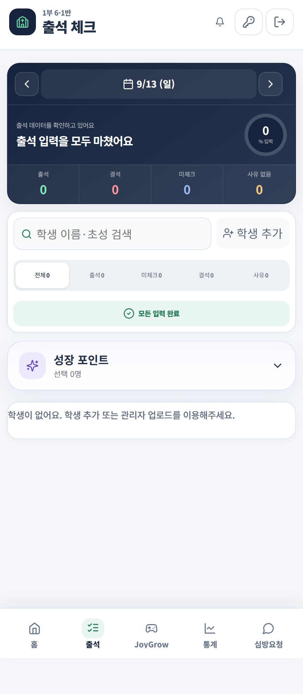

# 주일 출석 기록

날짜와 예배를 선택한 뒤 학생별 출석 상태와 활동을 기록합니다.

## 기록 순서

1. 출석 날짜와 예배를 선택합니다.
2. 반 또는 이름으로 학생을 찾습니다.
3. 출석 또는 결석을 기록합니다.
4. 결석이면 확인한 사유를 함께 남깁니다.
5. 오목과 재량 점수를 확인하고 저장합니다.

## 기록 항목

| 항목 | 기록 기준 |
|---|---|
| 출석·결석 | 실제 확인한 사실만 기록 |
| 결석 사유 | 보호자나 담당 교사에게 확인한 내용 |
| 오목 | 1–3회와 4–6회 구간에 맞게 입력 |
| 재량 | 정해진 운영 기준 안에서만 입력 |

가족이 같은 이유로 결석했다면 가족 연결 기능으로 함께 기록할 수 있습니다. 예정된 장기 결석은 기간과 사유를 저장해 목양센터의 후속 관리로 연결합니다.

> 빈칸은 결석이 아닙니다. 확인하지 못한 상태를 추측으로 채우지 마세요.
