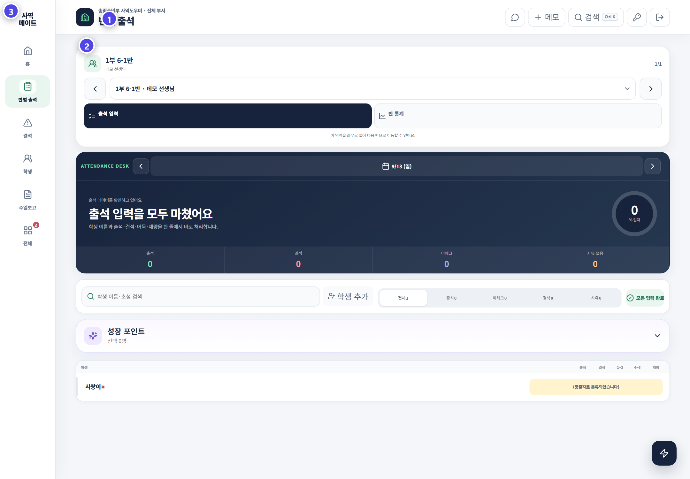

# 주일 출석 기록

반별 출석에서는 학생 이름, 출결, 오목과 재량을 한 줄에서 처리합니다. 날짜와 반을 확인한 뒤 기록하세요.

## 화면 구성

| 위치 | 기능 |
|---|---|
| 상단 반 선택 | 예배·반·담당 교사 확인, 이전·다음 반 이동 |
| 출석 입력 / 반 통계 | 기록 화면과 통계 화면 전환 |
| 날짜 막대 | 이전·다음 주일 이동, 현재 기록 날짜 확인 |
| 진한 남색 요약 | 입력률, 출석·결석·미체크·사유 없음 숫자 |
| 검색과 상태 탭 | 학생 검색, 전체·출석·미체크·결석·사유 필터 |
| 성장 포인트 | 여러 학생의 활동을 선택해 기록 |
| 학생 행 | 출석·결석·1–3·4–6·재량 처리 |

## 출석 입력 순서

1. 상단에서 **예배·반·담당 교사**가 맞는지 확인합니다.
2. 날짜 막대에서 기록할 주일을 확인합니다.
3. 학생 행의 **출석** 또는 **결석**을 선택합니다.
4. 결석 학생은 확인한 사유를 입력합니다.
5. 오목은 **1–3** 또는 **4–6** 구간을 선택합니다.
6. 필요한 경우 운영 기준 안에서 **재량**을 기록합니다.
7. 남색 요약의 **미체크 0명**, **사유 없음 0명**을 확인합니다.

## 상태를 수정할 때

- 이미 저장된 출석을 바꾸기 전 날짜와 학생을 다시 확인합니다.
- 부관리자는 편집 모드를 요청하거나 해제해야 할 수 있습니다.
- 가족이 같은 사유로 결석한 경우 가족 연결 안내를 확인해 함께 반영할 수 있습니다.
- 예정된 결석은 시작일·종료일·사유를 기록해 목양 후속 관리와 연결합니다.

## 성장 포인트

출석·오목·재량은 JoyGrow 포인트와 EXP에 연결됩니다. 포인트를 맞추기 위해 출석 사실을 바꾸지 말고, 실제 출석 기록을 원본으로 유지하세요.

> 빈칸은 결석이 아닙니다. 확인하지 못한 상태를 추측으로 채우지 마세요.
