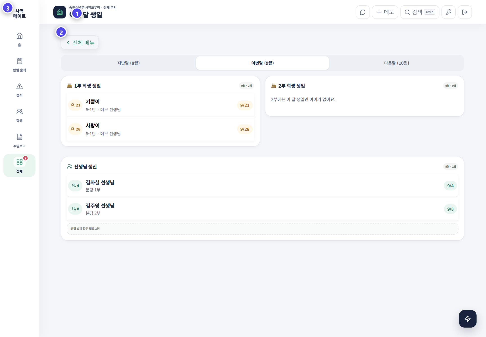
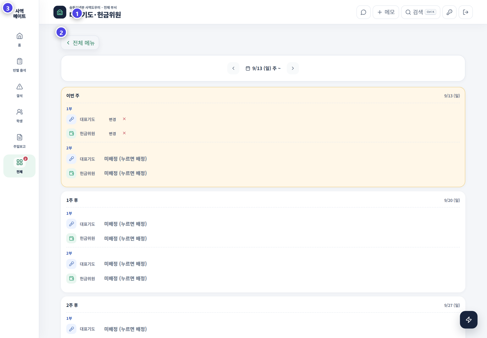

# 생일과 기도·헌금위원

생일과 예배 담당은 주일 준비 단계에서 미리 확인하는 메뉴입니다.

## 생일

지난달·이번 달·다음 달 학생을 나누어 보여 줍니다. 학생 이름과 생일을 확인합니다. 반과 예배도 함께 확인해 준비가 빠지지 않도록 합니다.

1. 이번 달 탭을 먼저 확인합니다.
2. 주일 전에 해당 주간 생일 학생을 찾습니다.
3. 반과 예배가 맞는지 확인합니다.
4. 생일이 잘못 보이면 학생 정보의 생년월일을 수정합니다.

## 대표기도·헌금위원

1. 배정할 주일과 예배를 선택합니다.
2. 대표기도 또는 헌금위원을 선택합니다.
3. 학생 이름과 반을 확인합니다.
4. 저장 뒤 홈과 해당 주일 화면에서 반영 여부를 확인합니다.

| 점검 | 이유 |
|---|---|
| 날짜 | 다른 주일에 잘못 배정하지 않기 위해 |
| 예배 | 1부와 2부 담당이 섞이지 않도록 |
| 학생·반 | 동명이인과 반 이동 학생 구분 |
| 중복 | 같은 학생에게 역할이 과도하게 몰리지 않도록 |

> 배정은 저장으로 끝나지 않습니다. 담당 교사와 학생에게 실제로 안내되었는지 확인하세요.
