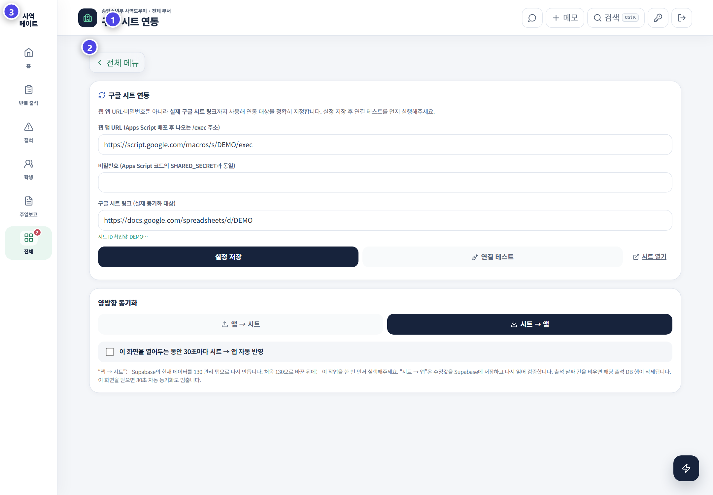
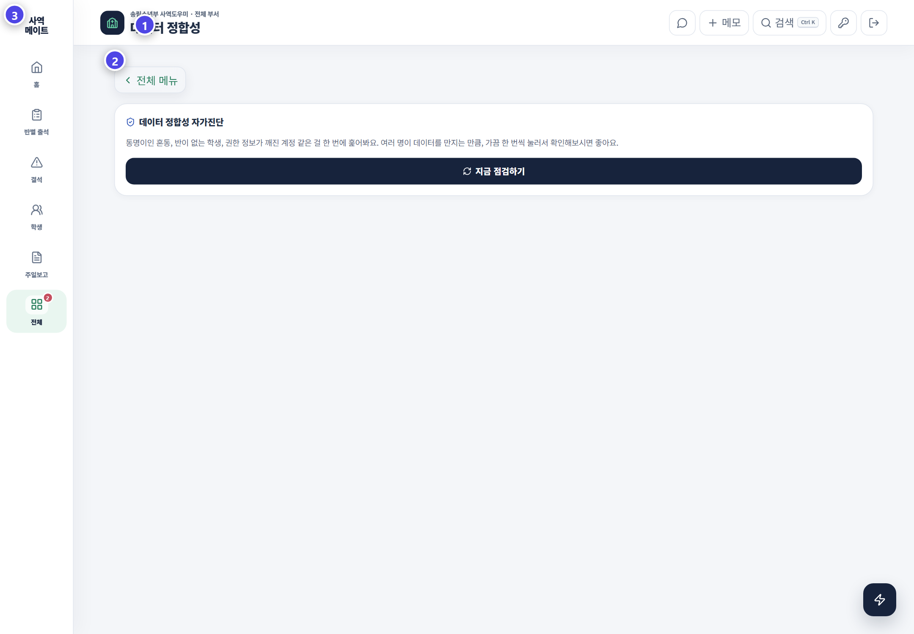
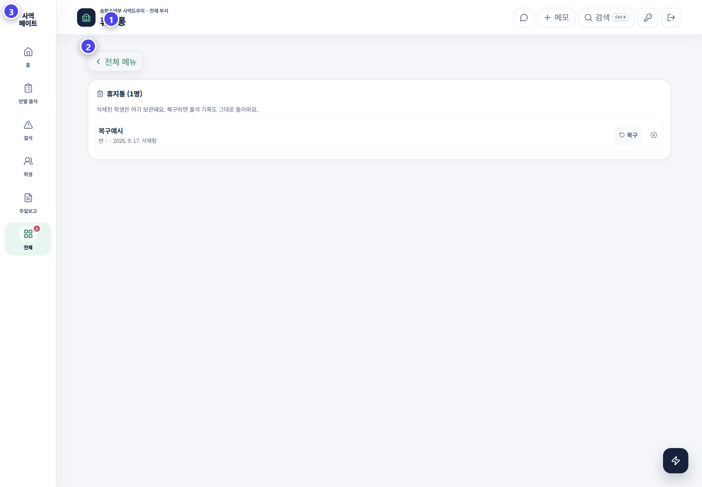

# 데이터 연동·점검·복구

대량 데이터 작업은 **백업 → 실행 → 표본 확인** 순서로 진행합니다.

## 구글 시트 연동

1. Apps Script 주소와 시트 연결 상태를 확인합니다.
2. 연결 테스트를 실행합니다.
3. 작업할 데이터 범위와 방향을 확인합니다.
4. 내보내기 또는 가져오기를 실행합니다.
5. 학생 수, 반 수와 최근 출석 몇 건을 원본과 비교합니다.

> 출석 시트의 날짜 칸이 비어 있으면 가져오기 과정에서 앱의 해당 날짜 기록도 삭제될 수 있습니다. 빈칸을 정리하기 전에 원본 파일을 보관하세요.

## 데이터 점검

| 검사 | 확인할 문제 |
|---|---|
| 같은 반의 중복 이름 | 중복 등록 또는 동명이인 |
| 미배정 학생 | 반 연결 누락 |
| 등록 전 출석 | 시작일보다 앞선 출석 |
| 담당 반 없는 교사 | 계정과 반 연결 누락 |
| 한 반의 복수 교사 | 의도한 공동 담당인지 확인 |
| 권한 없는 로그인 계정 | 역할 설정 누락 |
| 삭제 학생의 목양 기록 | 복구 또는 기록 정리 필요 |
| 생일 형식 오류 | 잘못된 날짜 값 |

## 휴지통

- **복구**: 학생과 연결 가능한 기록을 다시 살립니다.
- **영구 삭제**: 복구가 어렵습니다. 학생·반·과거 기록을 재확인한 뒤 실행합니다.
- 휴지통에서 이름이 같으면 삭제일과 반을 함께 확인합니다.

## 전체 엑셀

가져오기는 반·학생·출석·출석 메모·프로그램·팀·담당·양육보고서·장결·계정 정보에 영향을 줄 수 있습니다. 출석 시트는 양방향 동기화이므로 빈 셀도 변경으로 해석될 수 있습니다.

> 대량 작업 직후에는 전체를 믿고 넘어가지 말고 최근 주일과 몇 명의 학생을 표본 확인하세요.
