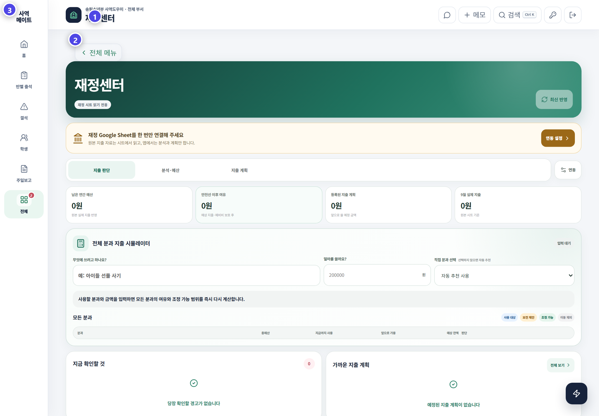

# 재정센터

재정센터는 재정 시트의 현황을 읽고 예정 지출과 예산 흐름을 확인하는 운영 화면입니다.

## 확인 순서

1. 연결된 재정 시트와 마지막 갱신 시간을 확인합니다.
2. 현재 잔액과 기간별 지출을 봅니다.
3. 예정 지출이 예산 안에 있는지 확인합니다.
4. 필요한 경우 예측·예산 자료를 내보냅니다.

## 연결이 되지 않을 때

| 증상 | 확인할 것 |
|---|---|
| 자료가 비어 있음 | Apps Script 주소와 공유 설정 |
| 갱신이 오래됨 | 새로고침 후 마지막 동기화 시간 |
| 권한 오류 | 재정센터 접근 권한 |
| 숫자가 다름 | 원본 시트의 기간·항목·수식 |

재정센터 접근은 허용된 관리자에게만 제공됩니다. 공유 화면이나 문의 자료에는 계좌·개인정보·비밀키가 보이지 않게 합니다.

> 앱은 재정 흐름을 보기 쉽게 보여 줍니다. 최종 근거는 승인된 원본 재정 기록입니다.
