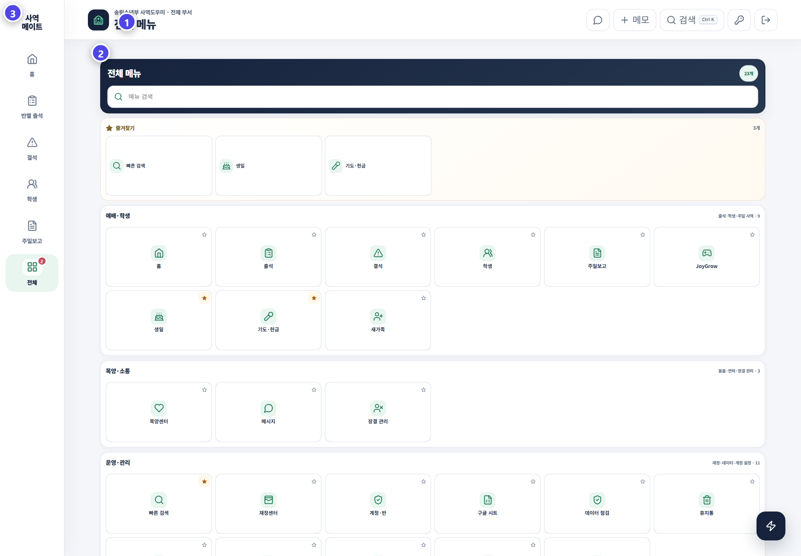

# 화면 구성과 이동 방법

PC에서는 왼쪽 고정 메뉴를 사용합니다. 모바일에서는 화면 아래 메뉴가 같은 기능을 담당합니다. 현재 선택한 메뉴는 연한 민트색 배경으로 표시됩니다.

## 화면 번호 읽기

| 번호 | 화면 요소 | 사용법 |
|---:|---|---|
| ① | 업무 제목 | 현재 위치를 확인하고 검색·메모·계정·로그아웃 사용 |
| ② | 본문 카드 | 날짜·탭·필터를 고른 뒤 내용을 확인하거나 저장 |
| ③ | 주요 메뉴 | 홈·반별 출석·결석·학생·주일보고·전체로 이동 |

## 색과 상태의 의미

| 표현 | 의미 |
|---|---|
| 진한 남색 카드 | 현재 주일의 핵심 현황이나 반드시 볼 요약 |
| 민트색 | 선택된 메뉴 · 정상 완료 · 이동 가능한 핵심 기능 |
| 보라색 | 저장·제출·JoyGrow처럼 실행이 필요한 주요 작업 |
| 노란색·주황색 | 사유 누락 또는 확인이 필요한 항목 |
| 빨간색 | 결석이나 오류 · 즉시 확인해야 하는 상태 |
| 숫자 배지 | 아직 처리하지 않은 항목 수 |

## 이동할 때 기억할 것

- 왼쪽 메뉴를 누르면 같은 자리에서 화면만 바뀝니다.
- **전체**는 23개 운영 메뉴를 업무 분야별로 묶어 보여 줍니다.
- 상세 도구에서 **전체 메뉴**를 누르면 도구 목록으로 돌아갑니다.
- 모바일의 **바로가기** 버튼은 검색·메모·출력 같은 공통 기능을 모아 보여 줍니다.

> 화면 제목이 예상과 다르면 입력하기 전에 왼쪽 메뉴와 선택된 날짜부터 확인하세요.
