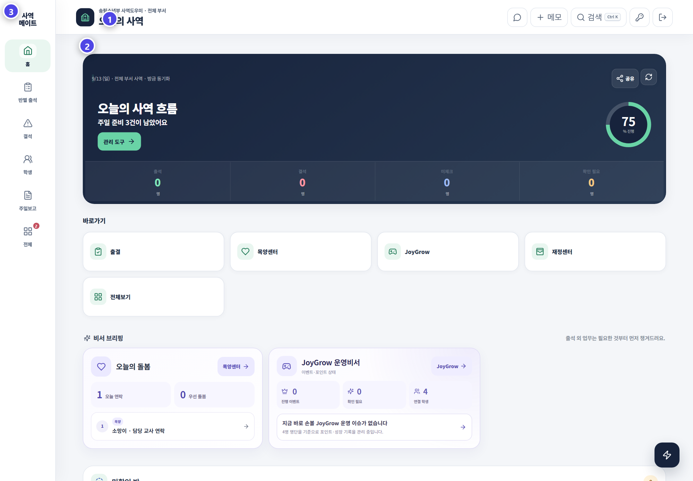

# 로그인과 관리자 홈

로그인 뒤 처음 보이는 홈은 단순 대시보드가 아니라, 오늘 처리할 일을 순서대로 알려 주는 사역 브리핑 화면입니다.

## 로그인

1. 발급받은 아이디와 비밀번호를 입력합니다.
2. 관리자 모드로 들어갑니다.
3. 화면 위에 표시된 부서 범위와 자신의 권한을 확인합니다.
4. 공용 PC에서는 업무를 마친 뒤 반드시 로그아웃합니다.

## 홈 화면 읽기

| 영역 | 무엇을 보여 주나요? | 다음 행동 |
|---|---|---|
| 오늘의 사역 흐름 | 출석·결석·미체크·확인 필요와 진행률 | **관리 도구**로 남은 업무 확인 |
| 바로가기 | 출결, 목양센터, JoyGrow, 재정센터, 전체보기 | 필요한 업무로 즉시 이동 |
| 오늘의 돌봄 | 오늘 연락할 학생과 우선 돌봄 | 학생을 열어 목양 행동 확인 |
| JoyGrow 운영비서 | 이벤트·포인트 운영 상태 | 확인 필요 항목이 있을 때 통제센터 이동 |
| 미확인 반 | 출석 입력을 마치지 않은 반 | 해당 반으로 이동해 기록 마감 |

## 상단 버튼

- 말풍선: 교사가 보낸 심방·목양 요청
- **+ 메모**: 목양 내용을 빠르게 기록
- **검색 / Ctrl K**: 학생과 기능을 한 번에 검색
- 열쇠: 계정 설정과 비밀번호 변경
- 나가기: 로그아웃

읽기 전용 관리자는 같은 화면을 볼 수 있지만 저장·수정·삭제는 차단됩니다.

> 홈의 숫자를 없애는 것보다, 숫자 뒤에 있는 학생을 정확히 확인하는 것이 먼저입니다.
