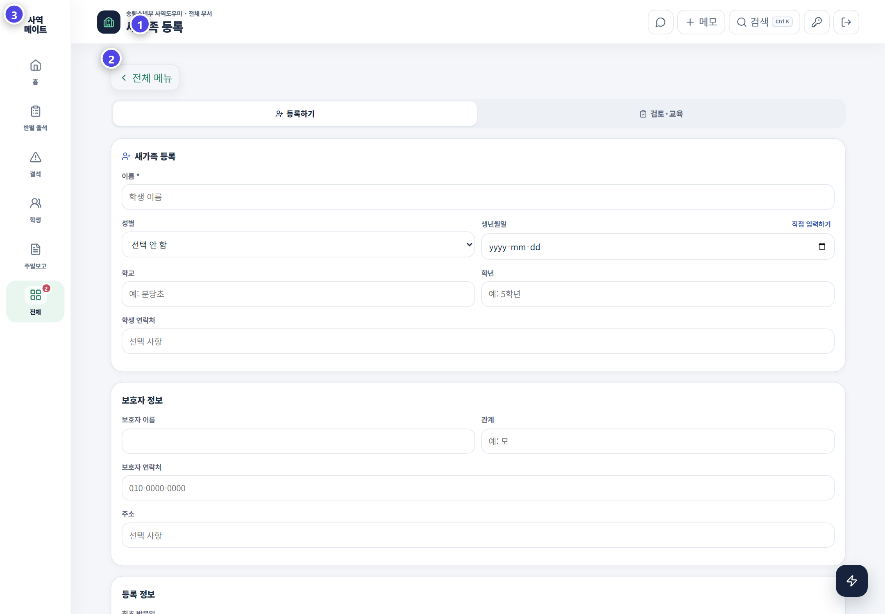
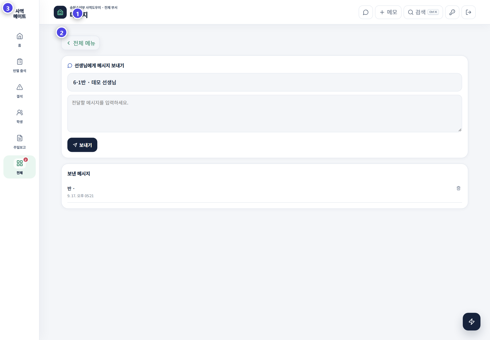

# 새가족과 메시지

새가족 화면은 첫 방문부터 정식 학생 전환까지를 관리하고, 메시지는 교사에게 필요한 운영 안내를 전달합니다.

## 새가족

| 단계 | 확인할 내용 |
|---|---|
| 접수 | 이름·생년·학교·보호자 연락처·예배 |
| 확인 | 중복 학생 여부와 현재 상태 |
| 교육 | 교육 방식, 주차와 교육일 |
| 반 배정 | 예배·반·담당 교사 |
| 학생 전환 | 학생 명단과 출석 화면 반영 여부 |

새가족을 학생으로 전환하기 전 같은 이름이 이미 있는지 검색합니다. 반을 배정한 뒤에는 반별 출석 명단에서 실제로 보이는지 확인합니다.

## 메시지

1. 전달할 대상 반을 선택합니다.
2. 제목은 한눈에 목적을 알 수 있게 씁니다.
3. 내용에는 해야 할 행동과 기한을 먼저 적습니다.
4. 발송 전 개인정보가 들어 있지 않은지 확인합니다.
5. 보낸 뒤 발송 내역을 확인합니다.

읽기 전용 관리자는 메시지를 볼 수 있지만 새 메시지 작성이나 삭제가 제한됩니다.

> 메시지는 상담 기록을 보내는 곳이 아닙니다. 필요한 운영 안내만 간결하게 전달하세요.
