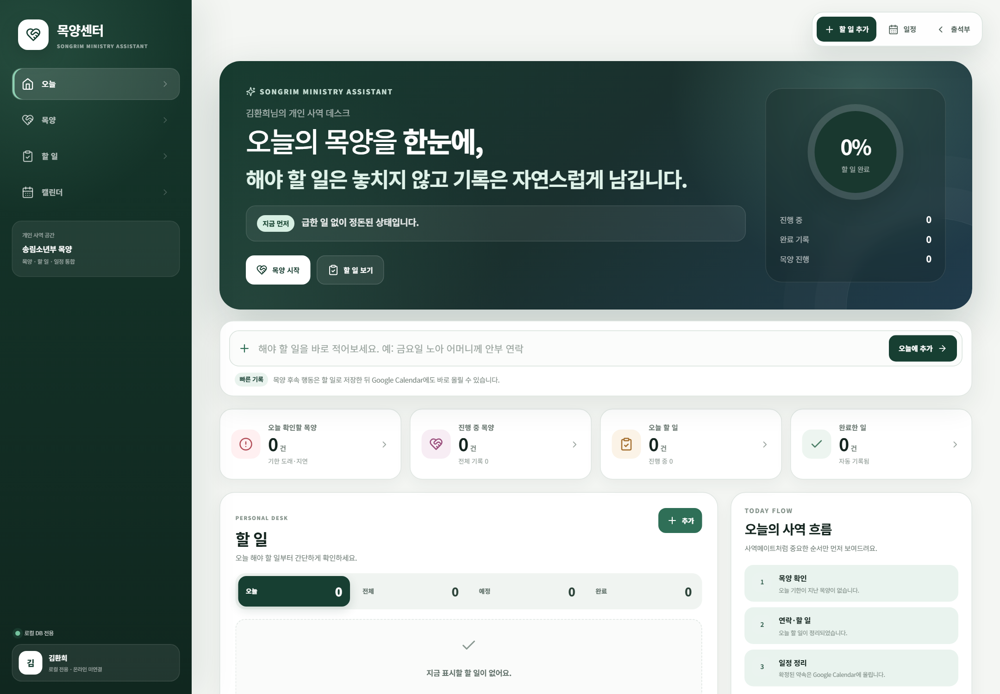

# 목양센터

목양센터는 출석부에서 발견한 돌봄 필요를 연락·기도·심방·할 일로 이어 가는 로컬 업무 공간입니다.

## 목양 기록을 시작할 때

1. 학생 검색으로 기존 인물을 먼저 찾습니다.
2. 출석부 학생과 연결된 동일 인물인지 확인합니다.
3. 상황을 짧고 사실 중심으로 기록합니다.
4. 연락·기도·심방·확인 중 다음 행동을 선택합니다.
5. 담당자와 예정일을 남깁니다.

## 이름을 통일하는 원칙

- `이철균 가정`과 `이철균 선생님`과 `이철균 집사님`은 기본 인물 이름 **이철균**으로 연결합니다.
- 선생님·집사님·가정 같은 표현은 호칭 또는 관계 정보로 남깁니다.
- 같은 사람을 새 인물로 만들기 전에 기존 기록을 검색합니다.
- 동명이인은 반·예배·가족 관계로 구분합니다.

## 로컬 저장과 동기화

목양센터는 빠른 실행을 위해 로컬 데이터를 우선 사용합니다. 온라인 자료가 필요할 때만 목양센터 안의 동기화 기능을 실행합니다.

| 작업 | 기준 |
|---|---|
| 평소 기록·검색 | 로컬 데이터 사용 |
| 클라우드 자료 가져오기 | 사용자가 동기화 버튼을 누를 때만 실행 |
| 동기화 전 | 로컬 백업과 대상 범위 확인 |
| 동기화 후 | 인원 수와 최근 기록을 표본 확인 |

## 민감한 내용

상담·건강·가정 형편은 목양에 필요한 범위만 적습니다. 외부 공유용 문장과 내부 기록을 구분합니다. 비밀번호나 인증정보는 저장하지 않습니다.

> 목양 기록에는 다음 행동과 확인 날짜가 남아 있어야 합니다.
