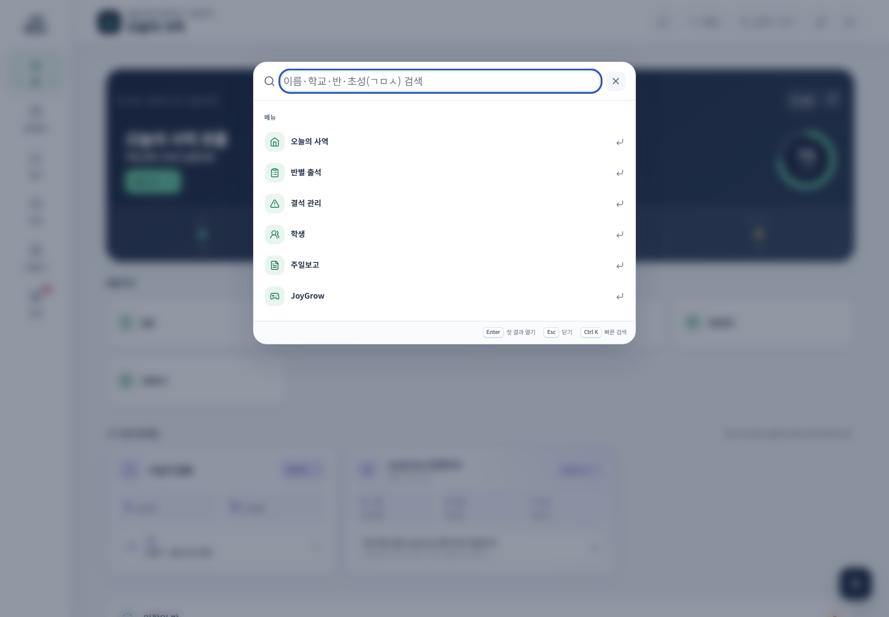

# 빠른 검색과 공통 기능

학생이나 기능의 위치를 모를 때는 메뉴를 여러 번 열지 말고 빠른 검색을 사용합니다.

## 빠른 검색 열기

- PC: 상단 **검색** 또는 `Ctrl + K`
- 모바일: **바로가기 → 검색**

## 검색 결과 사용법

1. 학생 이름 또는 메뉴 이름의 일부를 입력합니다.
2. 학생 결과에서는 반과 예배를 함께 확인합니다.
3. 기능 결과를 누르면 해당 관리 화면으로 이동합니다.
4. 검색창을 닫으려면 `Esc`를 누르거나 바깥 영역을 누릅니다.

## 자주 쓰는 공통 기능

| 기능 | 위치 | 용도 |
|---|---|---|
| 빠른 목양 메모 | 상단 **+ 메모** | 떠오른 목양 내용을 잊기 전에 기록 |
| 전체 엑셀 내보내기 | 전체 메뉴·바로가기 | 현재 데이터 백업 |
| 전체 엑셀 가져오기 | 전체 메뉴·바로가기 | 검토한 변경사항 일괄 반영 |
| 계정 설정 | 상단 열쇠 | 비밀번호 변경과 계정 확인 |

> 같은 이름이 검색되면 결과를 바로 선택하지 말고 반과 예배를 먼저 확인하세요.
