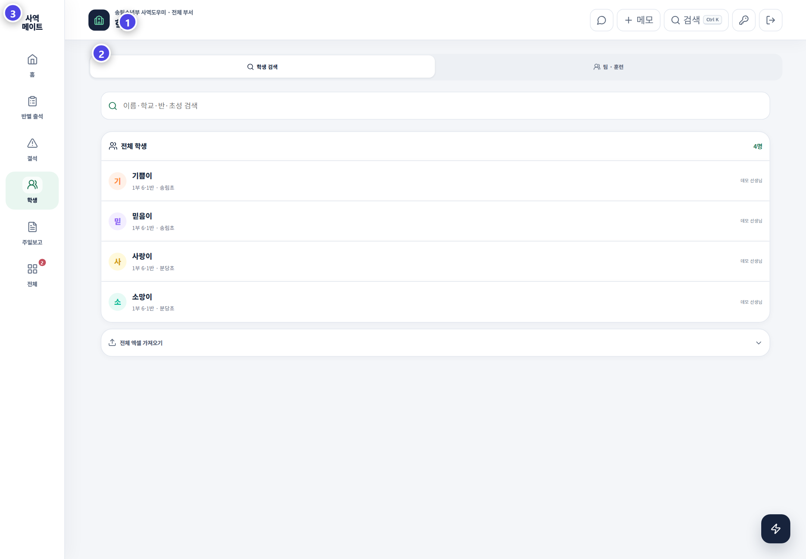

# 학생과 반 관리

학생 화면은 모든 학생을 한곳에서 찾는 기준 명단입니다. 상세 정보와 출석 이력과 목양 연결을 확인할 수 있습니다.

## 학생을 찾을 때

1. 이름 일부를 검색합니다.
2. 예배와 반 필터를 확인합니다.
3. 동명이인이면 생년과 학교를 봅니다. 담당 교사도 함께 확인합니다.
4. 학생 카드를 열어 상세 기록을 확인합니다.

## 학생을 등록할 때

1. 같은 이름이 이미 있는지 먼저 검색합니다.
2. 이름·생년·학교·연락처·시작일을 입력합니다.
3. 예배와 반을 선택합니다.
4. 저장 뒤 반별 출석 명단에 보이는지 확인합니다.

## 정보 수정과 반 이동

| 작업 | 확인할 것 |
|---|---|
| 이름 수정 | 기존 출석·목양·JoyGrow 연결 유지 |
| 반 이동 | 새 반 · 예배 · 적용 시점 |
| 연락처 수정 | 학생과 보호자 번호 구분 |
| 프로그램·팀 | 현재 참여 상태와 중복 등록 여부 |
| 장결 등록 | 기간·사유·다음 연락일 |
| 삭제 | 과거 출석과 목양 기록 영향 |

삭제가 필요하면 바로 영구 삭제하지 말고 휴지통을 사용합니다. 같은 학생을 호칭이나 띄어쓰기만 달리해 여러 번 등록하지 않습니다.

> 학생 명단이 정확해야 출석·목양·포인트·보고서가 한 아이에게 온전히 모입니다.
