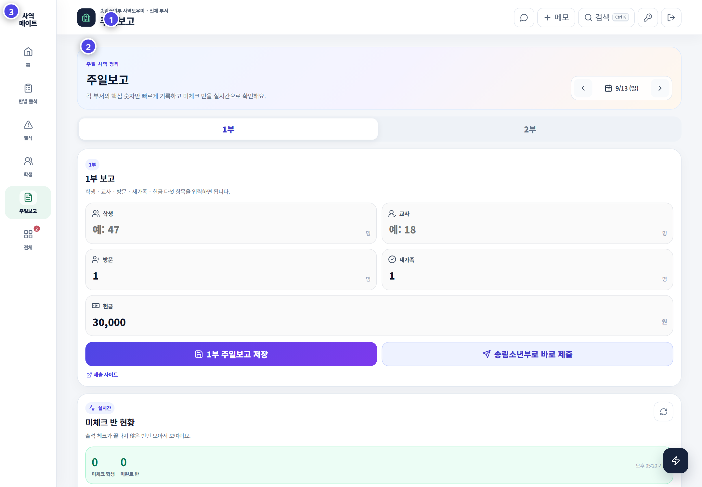

# 주일보고

주일보고는 출석 기록을 숫자로 마감하고 송림소년부 보고로 연결하는 마지막 단계입니다.

## 화면 구성

| 영역 | 기능 |
|---|---|
| 날짜 이동 | 이전·다음 주일 선택 |
| 1부 / 2부 탭 | 예배별 보고 전환 |
| 다섯 항목 | 학생·교사·방문·새가족·헌금 입력 |
| 보고 저장 | 현재 예배의 입력값 저장 |
| 송림소년부로 바로 제출 | 저장 후 교회 보고 시스템으로 전송 |
| 미체크 반 현황 | 출석 마감을 끝내지 않은 반 확인 |

## 보고 순서

1. 보고할 주일 날짜를 확인합니다.
2. 1부와 2부를 각각 열어 기록합니다.
3. 학생·교사·방문·새가족·헌금 다섯 항목을 입력합니다.
4. 출석 집계와 보고 숫자가 맞는지 비교합니다.
5. 미체크 학생과 미완료 반이 0인지 확인합니다.
6. **주일보고 저장**을 누릅니다.
7. 최고 관리자는 PC에서 **송림소년부로 바로 제출**을 실행합니다.

## 제출이 되지 않을 때

- 다섯 항목이 모두 입력되었는지 확인합니다.
- 최고 관리자 계정인지 확인합니다.
- PC 화면에서 실행 중인지 확인합니다.
- 선택한 주일과 예배가 맞는지 확인합니다.

> 제출은 출석과 보고 숫자의 확인이 끝났다는 표시입니다.
