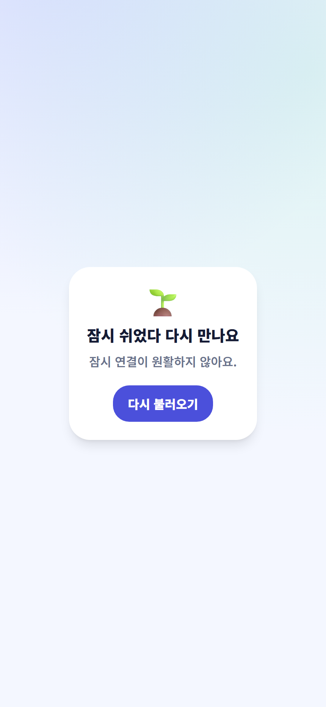

# 문제 해결과 문의

문제가 생기면 같은 버튼을 반복해서 누르지 말고 아래 순서로 확인하세요.

## 포인트가 다를 때

1. 학생 화면을 새로고침합니다.
2. 보관함의 활동과 날짜를 확인합니다.
3. 선생님은 출석 저장 또는 최근 지급 기록을 확인합니다.
4. 계속 다르면 학생의 이름·부서·반, 활동과 시간을 김환희 강도사에게 알립니다.

## 학생이 검색되지 않을 때

이름의 띄어쓰기, 활성 상태, 부서와 반을 확인합니다. 새 학생이나 반 이동 학생은 출석부와 JoyGrow 연결 상태도 확인하세요.

## 비밀번호를 잊었을 때

담당 선생님 또는 김환희 강도사에게 재설정을 요청합니다. 비밀번호를 공개 대화방에 보내지 마세요.

## 메뉴나 버튼이 없을 때

로그인한 역할과 담당 범위를 확인합니다. 칭찬 버튼은 주간 한도에 도달하면 완료 상태로 비활성화됩니다.

## 문의할 때 보낼 내용

* 사용한 화면
* 학생 이름·부서·반
* 발생한 날짜와 시간
* 누른 버튼이나 활동 이름
* 개인정보를 가린 화면 캡처

전화번호, 부모 연락처, 상담 기록, 비밀번호와 관리자 인증정보는 보내지 마세요.
