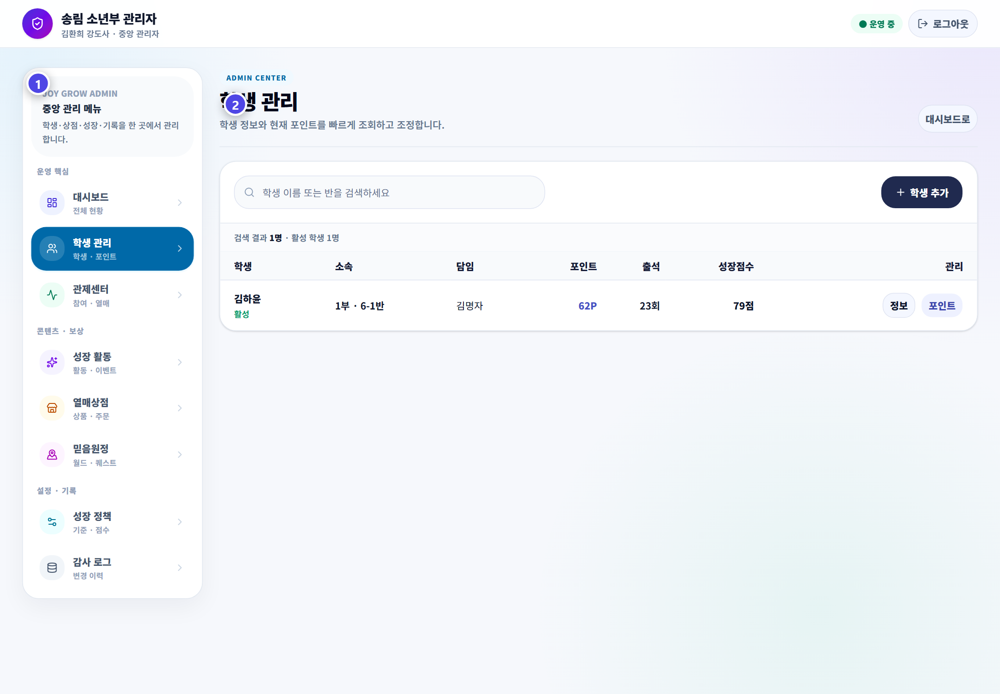
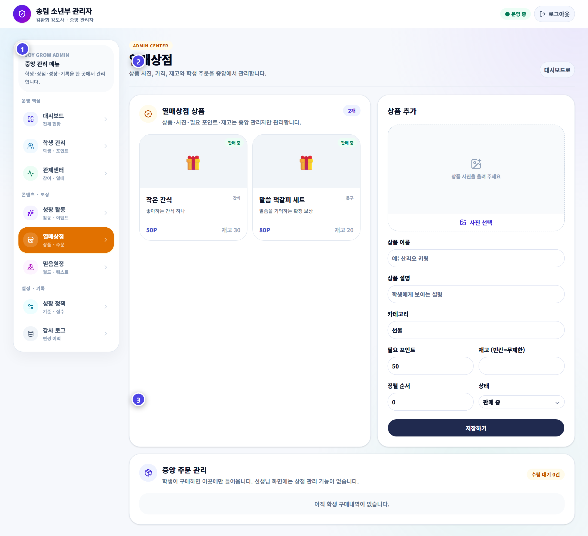

# 관리자 핵심 업무

관리자는 출석부 통제센터와 JoyGrow 독립 관리자를 목적에 맞게 나누어 사용합니다.

## 두 관리 화면

| 화면 | 담당 업무 |
|---|---|
| 출석부 `JoyGrow 통제센터` | 1·2부 현황, 교사 지급 로그, GPT 일괄 입력, 빠른 설정 |
| JoyGrow 독립 관리자 | 학생, 포인트, 상점, 성경 인물, 믿음 원정대, 정책, 감사 로그 |

## 학생과 포인트

- 학생 이름뿐 아니라 부서와 반을 확인합니다.
- 새 학생, 반 이동과 복귀 학생의 출석부 연결 상태를 확인합니다.
- 포인트 조정에는 다른 관리자가 이해할 수 있는 사유를 남깁니다.
- 포인트는 0보다 작아질 수 없습니다.
- 선생님의 최근 잘못 지급은 가능한 경우 지급 취소를 먼저 사용합니다.

### 자주 생기는 학생 업무

| 상황 | 처리 순서 |
|---|---|
| 새 학생 | 출석부 등록 → 부서·반 확인 → JoyGrow 검색 확인 → 첫 로그인 안내 |
| 반 이동 | 출석부 반 수정 → JoyGrow 연결 확인 → 기존 포인트·EXP 확인 |
| 장기 결석 후 복귀 | 활성 상태 확인 → 현재 반 연결 → 중복 학생 여부 확인 |
| 비밀번호 분실 | 학생 본인과 부서·반 확인 → 초기화 → 안전하게 새 번호 안내 |
| 잘못 지급 | 최근 지급 취소 확인 → 불가능할 때만 사유를 남겨 관리자 조정 |

## 포인트 상점

- 상품 가격과 재고, 외부 공개 가능한 이미지를 관리합니다.
- 학생 주문은 접수와 동시에 포인트와 재고에 반영됩니다.
- 대기 주문만 취소할 수 있으며 취소 시 포인트와 재고가 돌아옵니다.
- 실제 상품을 전달한 뒤에만 수령 완료로 처리합니다.

### 주문 예외 처리

| 상황 | 처리 방법 |
|---|---|
| 중복 주문 | 두 주문의 시간과 상태를 확인하고 대기 주문만 취소 |
| 품절 후 주문 | 학생에게 안내한 뒤 대기 주문 취소와 환불 확인 |
| 포인트만 차감 | 주문 내역과 감사 로그를 확인하고 임의 재지급 전 원인 확인 |
| 전달했지만 대기 중 | 학생과 상품을 다시 확인한 뒤 수령 완료 처리 |

## 성경 인물과 믿음 원정대

- 인물 변경 요청은 현재 인물, 요청 이유와 성장 기록 영향을 확인한 뒤 처리합니다.
- 시즌, 지역, 퀘스트와 아이템을 바꿀 때 진행 중인 학생에게 미치는 영향을 확인합니다.
- 캐릭터 선택 초기화는 포인트와 EXP를 지우는 작업이 아니라 선택 상태만 다시 여는 기능입니다.

## 이벤트와 성장 정책

- 이벤트의 시작일, 종료일, 대상 활동과 보상을 확인합니다.
- 끝난 이벤트가 계속 활성화되지 않도록 합니다.
- 성장점수 정책은 포인트 잔액과 다른 운영 지표입니다.
- 정책 변경 전 현재 값과 변경 이유를 기록하고 표본 결과를 비교합니다.

## 저장 전 마지막 확인

- 대상 학생 또는 적용 부서가 맞는가
- 포인트와 EXP의 방향과 숫자가 맞는가
- 시작일과 종료일이 맞는가
- 기존 기록을 지우거나 다시 계산하는 변경인가
- 변경 이유와 담당자가 기록되는가

> 대량 변경은 저장 전 대상, 숫자와 적용 범위를 한 번 더 읽습니다.
