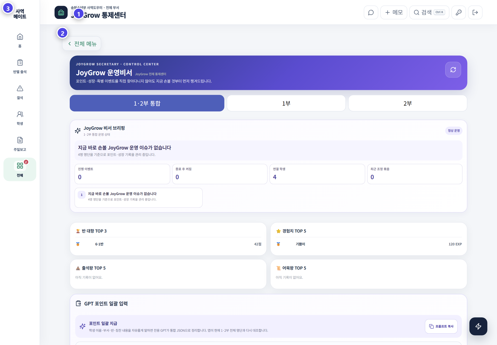

# 관제센터와 GPT 일괄 입력

관제 기능은 운영 이상을 빨리 찾는 도구입니다. 숫자만으로 학생의 태도나 믿음을 판단하지 않습니다.

## 관제센터에서 볼 것

- 진행·종료 이벤트와 연결 학생 수
- 최근 포인트 조정과 교사 지급 기록
- 반별, EXP, 출석과 어묵 랭킹
- 참여가 갑자기 줄어든 학생 신호
- 인기 목표 상품과 수령 대기 주문

## 숫자를 볼 때 주의할 점

| 신호 | 바로 단정하지 말 것 | 함께 확인할 것 |
|---|---|---|
| 포인트가 낮음 | 참여 의지가 낮다고 판단 | 최근 등록, 결석, 기록 누락 |
| 참여가 줄어듦 | 태도 문제라고 판단 | 반 이동, 건강, 가정 상황, 입력 지연 |
| 특정 반 점수가 높음 | 운영이 더 우수하다고 판단 | 반 인원, 출석률, 기록 습관 |
| 주문이 많음 | 과소비라고 판단 | 이벤트, 신상품, 재고와 중복 주문 |

## 이상 신호를 확인하는 순서

1. 조회 기간과 1·2부 범위를 확인합니다.
2. 출석 원본과 해당 학생의 최근 지급 기록을 봅니다.
3. 담당 선생님에게 실제 상황을 확인합니다.
4. 필요한 조정에 이유를 남깁니다.
5. 학생 화면과 감사 로그에서 결과를 다시 확인합니다.

## GPT 포인트 일괄 입력

여러 학생 활동을 한꺼번에 정리해야 할 때 총관리자만 사용합니다.

1. 화면의 전용 프롬프트를 복사합니다.
2. 개인정보를 최소화한 활동 내용을 준비합니다.
3. 생성된 JSON을 입력하고 검사를 실행합니다.
4. 동명이인, 미일치 학생, 항목과 숫자 경고를 확인합니다.
5. 잘못된 행은 제외하고 최종 대상과 총액을 사람이 검토합니다.
6. 반영 후 지급 묶음과 학생 표본을 확인합니다.

### 최종 반영 직전 체크

- 학생 수와 결과 행 수가 예상과 맞는가
- 동명이인은 부서와 반으로 구분됐는가
- 허용되지 않은 활동 이름이 섞이지 않았는가
- 포인트와 EXP가 현재 정책표와 맞는가
- 같은 학생·활동이 중복되지 않았는가
- 제외한 행이 최종 결과에서도 빠졌는가

## 잘못 반영했을 때

1. 같은 입력을 다시 실행하지 않습니다.
2. 지급 묶음과 반영 시각을 기록합니다.
3. 화면에 전체 취소 기능이 있으면 대상 묶음을 다시 확인합니다.
4. 일부만 문제라면 학생별 원본 기록을 확인합니다.
5. 취소 또는 조정 뒤 학생 표본과 감사 로그를 확인합니다.

## GPT에 넣으면 안 되는 정보

- 전화번호와 부모 연락처
- 상담·목양 기록
- 비밀번호와 관리자 인증정보
- API 키, 환경변수와 내부 보안 설정

> AI가 만든 결과는 입력 초안입니다. 저장 판단과 결과 확인은 관리자의 책임입니다.
