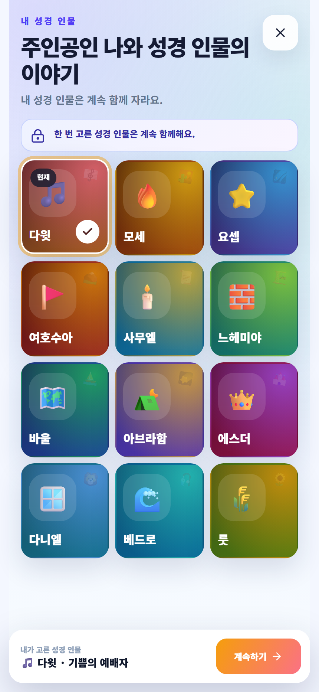
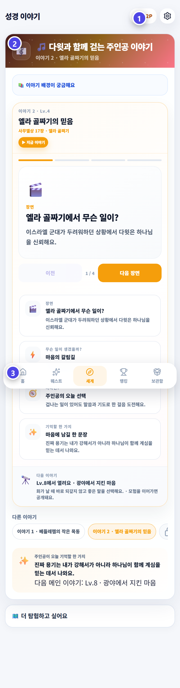

# 퀘스트·세계·랭킹·보관함

포인트와 경험치를 모으면 내가 고른 성경 인물과 믿음원정의 여정이 자라요.

## 퀘스트

이번 주에 어떤 활동을 했는지 볼 수 있어요. 출석부와 선생님의 칭찬 기록이 연결되면 퀘스트가 채워져요.

## 성경 인물

좋아하거나 닮고 싶은 성경 인물을 골라 보세요. 경험치가 쌓이면 인물의 레벨과 이야기가 자라요.

인물을 바꾸고 싶다면 설정에서 변경을 요청할 수 있어요. 바로 바뀌는 것은 아니며 선생님이 확인해요.

## 믿음원정 · 세계

아래 메뉴의 `세계`를 누르면 열려 있는 성경 이야기와 지역을 볼 수 있어요. 잠긴 이야기는 활동과 퀘스트를 이어 가면 열려요.

## 랭킹과 보관함

랭킹은 누가 더 믿음이 좋은지 정하는 표가 아니에요. 나와 친구들이 얼마나 꾸준히 참여했는지 응원하며 보는 곳이에요. 각 순위의 **오름차순·내림차순**을 눌러 보는 순서를 바꿀 수 있어요.

보관함에서는 얻은 아이템, 칭호, 업적과 지난 활동을 다시 볼 수 있어요.

> 다른 친구와 비교하기보다 지난주의 나보다 한 걸음 더 성장해 보세요.
