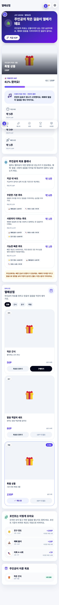

# 열매상점과 도움말

모은 포인트로 열매상점에서 원하는 상품을 고르고 주문할 수 있어요. 상품에 사진이 여러 장 있으면 넘겨 보며 확인하세요.

## 상품 주문하기

1. 상품 가격과 내 포인트를 확인해요.
2. 상품이 품절되지 않았는지 확인해요.
3. 구매 버튼을 눌러요.
4. 확인 창에서 상품과 차감될 포인트를 다시 확인해요.
5. 주문 내역에서 상태를 확인해요.

| 주문 상태 | 뜻 |
|---|---|
| 준비 중 | 선생님이 상품을 준비하고 있어요. |
| 수령 완료 | 상품을 받았어요. |
| 취소됨 | 주문이 취소되고 포인트가 돌아왔어요. |

## 문제가 있나요?

| 문제 | 이렇게 해 보세요 |
|---|---|
| 이름이 검색되지 않아요 | 이름과 부서·반을 확인한 뒤 선생님께 말해요. |
| 비밀번호를 잊었어요 | 담당 선생님께 초기화를 부탁해요. |
| 포인트가 안 들어왔어요 | 새로고침한 뒤 활동과 날짜를 선생님께 말해요. |
| 주문이 보이지 않아요 | 같은 버튼을 다시 누르지 말고 주문 내역을 먼저 확인해요. |
| 화면에 다시 시도가 보여요 | 인터넷을 확인하고 잠시 뒤 한 번만 다시 눌러요. |
| 설치 버튼이 안 보여요 | [기기별 설치 안내](../getting-started/install.md)를 봐요. 설치하지 않아도 앱 주소로 사용할 수 있어요. |

> 비밀번호, 전화번호와 가족 연락처는 공개 대화방에 올리지 마세요. 도움이 필요하면 담당 선생님이나 김환희 강도사에게 말해 주세요.
