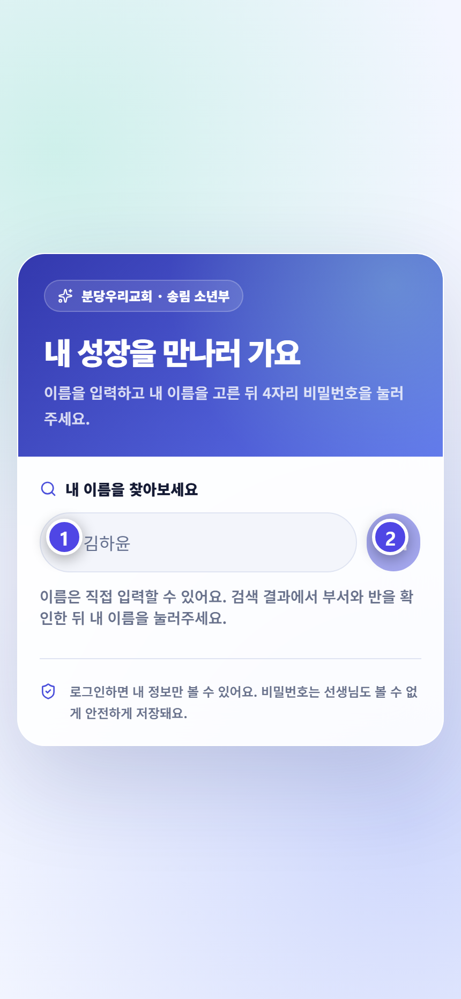
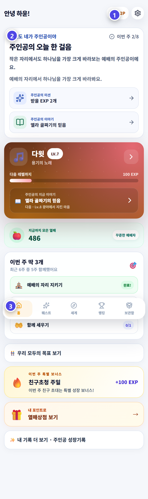

# 주인공 사용법

학생은 JoyGrow 이야기의 주인공입니다. 로그인하면 홈에서 포인트와 오늘의 성장을 확인할 수 있습니다.

## 로그인

1. 이름을 검색합니다.
2. 부서와 반을 확인해 내 이름을 고릅니다.
3. 숫자 4자리 비밀번호를 입력합니다.

같은 이름이 있으면 부서와 반으로 구분합니다. 이름이 없거나 비밀번호를 잊었으면 담당 선생님에게 말해 주세요.

## 홈에서 볼 것

| 위치 | 확인할 내용 |
|---|---|
| 화면 위 | 현재 사용할 수 있는 포인트 |
| 오늘 한 걸음 | 오늘의 안내와 이번 주 미션 |
| 성경 인물 카드 | 레벨과 다음 레벨까지의 EXP |
| 아래 메뉴 | 퀘스트, 세계, 랭킹, 보관함 |

포인트 상점은 홈의 `열매상점 보기` 버튼으로 들어갑니다. 앱에 보이는 `열매상점`과 이 가이드의 `포인트 상점`은 같은 기능입니다.

## 비밀번호와 로그아웃

화면 위 톱니바퀴에서 비밀번호 변경과 로그아웃을 할 수 있습니다. 공용 기기에서는 반드시 로그아웃하세요.

> 포인트보다 예배와 말씀, 섬김을 꾸준히 이어 가는 것이 더 중요합니다.
