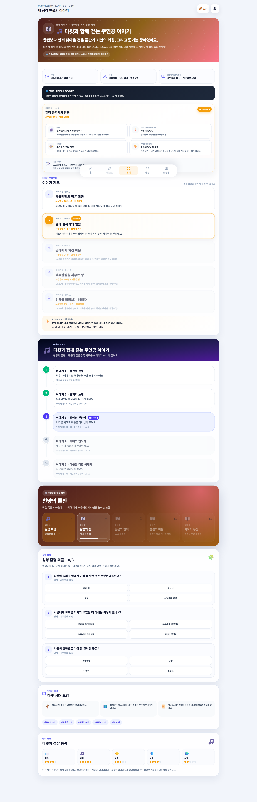

# 믿음 원정대

성경 이야기와 지역을 따라가며 내 성장 여정을 살펴봅니다.

## 이 화면에서 할 수 있어요

① 지금 열린 성경 이야기 확인  
② 월드 지역과 다음 여정 살펴보기  
③ 공동체 목표와 원정 기록 확인  
④ 얻은 아이템과 다음 해제 조건 확인

## 이렇게 사용하세요

1. 아래 메뉴에서 `세계`를 누릅니다.
2. 현재 열린 이야기와 지역을 확인합니다.
3. 잠긴 이야기의 조건을 살펴봅니다.
4. 퀘스트와 좋은 활동을 이어 가며 다음 여정을 엽니다.

> **기억하세요**  
> 화면 메뉴의 `세계`는 이 가이드에서 말하는 **믿음 원정대** 화면입니다.
