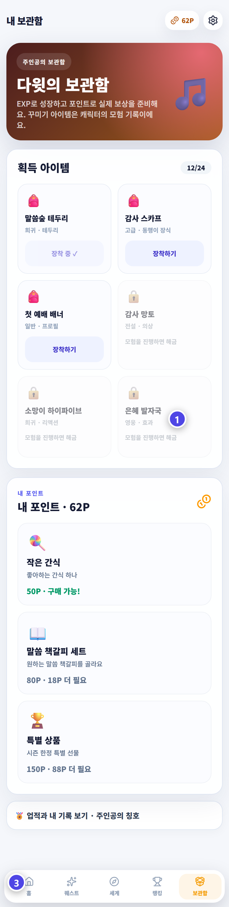

# 퀘스트와 믿음 원정대

아래 메뉴의 퀘스트, 세계, 랭킹, 보관함에서 주인공의 성장 여정을 확인합니다.

## 퀘스트

출석부 기록과 선생님의 칭찬이 퀘스트에 연결됩니다. 주인공이 직접 완료 표시를 하는 방식은 아닙니다.

## 성경 인물과 믿음 원정대

좋아하거나 닮고 싶은 성경 인물을 고르고 EXP로 성장시킵니다. 화면의 `세계` 메뉴에서 성경 이야기, 열린 지역과 공동체 목표를 볼 수 있습니다.

인물을 바꾸고 싶으면 설정에서 요청합니다. 변경은 관리자가 확인한 뒤 적용되며 성장 기록에 영향을 줄 수 있습니다.

## 랭킹과 보관함

랭킹은 꾸준한 참여를 응원하는 참고 정보입니다. 누가 더 믿음이 좋은지 정하는 표가 아닙니다.

보관함에서는 아이템, 칭호, 업적과 지난 활동을 다시 볼 수 있습니다.

> 기록이 보이지 않으면 새로고침한 뒤 담당 선생님에게 활동이 저장됐는지 확인해 주세요.
