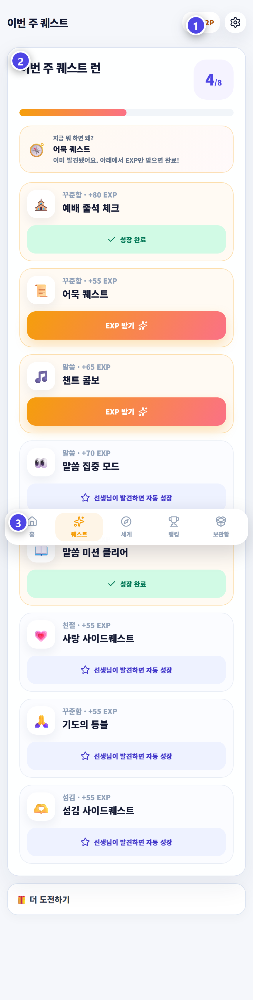
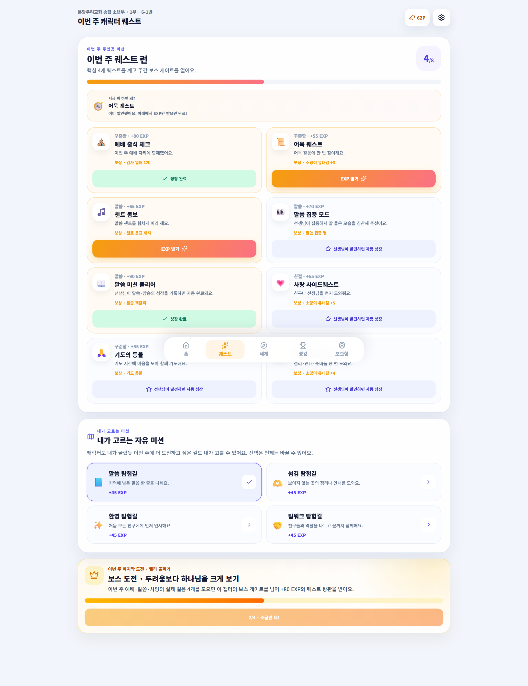

# 성장과 퀘스트

이번 주에 도전할 활동과 완료 상태를 확인하는 화면입니다.

## 이 화면에서 할 수 있어요

① 주간 퀘스트의 진행 상태 확인  
② 받을 수 있는 퀘스트 보상 받기  
③ 자유 미션과 주간 보물 확인

## 이렇게 사용하세요

1. 아래 메뉴에서 `퀘스트`를 누릅니다.
2. 완료된 퀘스트를 찾습니다.
3. 받을 수 있는 보상이 있으면 보상 버튼을 누릅니다.

> 기억하세요  
> 교사가 기록한 실제 활동이 퀘스트 진행에 반영됩니다.
