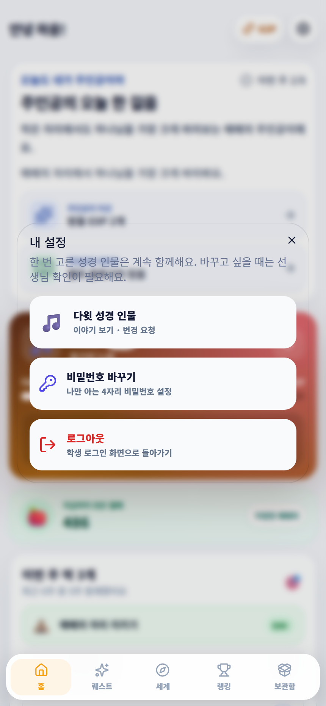
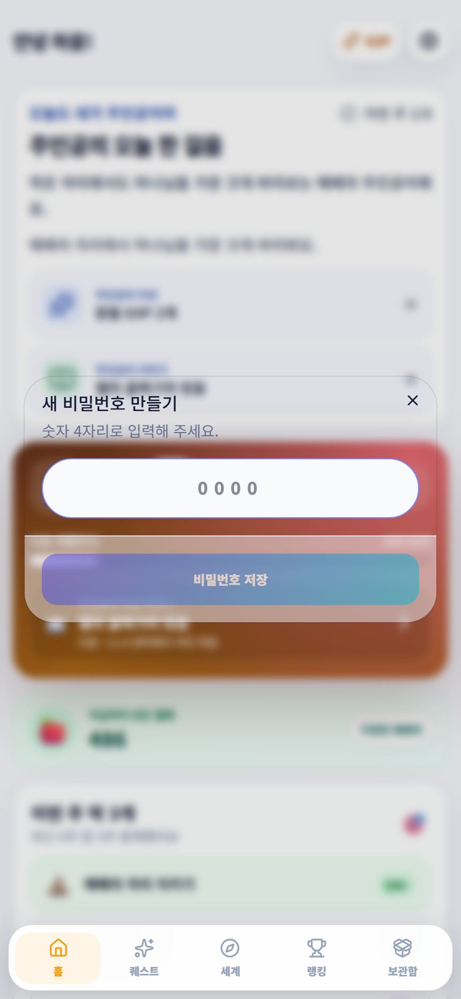

# 설정과 비밀번호

성경 인물, 4자리 비밀번호, 로그아웃을 관리하는 창입니다.

## 이 화면에서 할 수 있어요

① 성경 인물 이야기와 변경 요청 열기  
② 4자리 비밀번호 바꾸기  
③ 로그아웃

## 이렇게 사용하세요

1. 화면 위의 톱니바퀴 버튼을 누릅니다.
2. 필요한 메뉴를 누릅니다.
3. 비밀번호는 기억할 수 있는 새 숫자 4자리로 저장합니다.

> 기억하세요  
> 비밀번호를 다른 사람에게 알려 주지 마세요.
