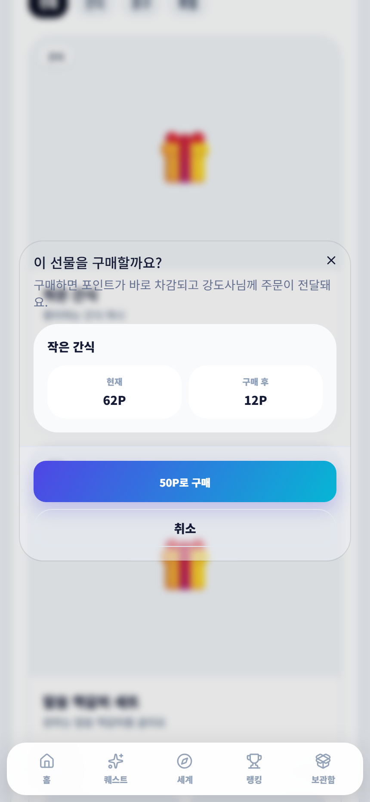

# 포인트 상점

모은 포인트로 원하는 상품을 정하고 주문합니다. 현재 앱에는 `열매상점`이라고 표시될 수 있습니다.

## 주문 방법

1. 상품의 가격과 재고, 내 포인트를 확인합니다.
2. 구매 버튼을 누릅니다.
3. 확인 창에서 상품과 사용할 포인트를 다시 봅니다.
4. 주문 뒤 주문 내역의 상태를 확인합니다.

| 상태 | 뜻 |
|---|---|
| 준비 중 | 주문이 접수되어 상품을 준비하는 중 |
| 수령 완료 | 상품을 실제로 받음 |
| 취소됨 | 주문이 취소되고 포인트가 환불됨 |

> 같은 버튼을 여러 번 누르지 말고 주문 내역을 먼저 확인하세요.
