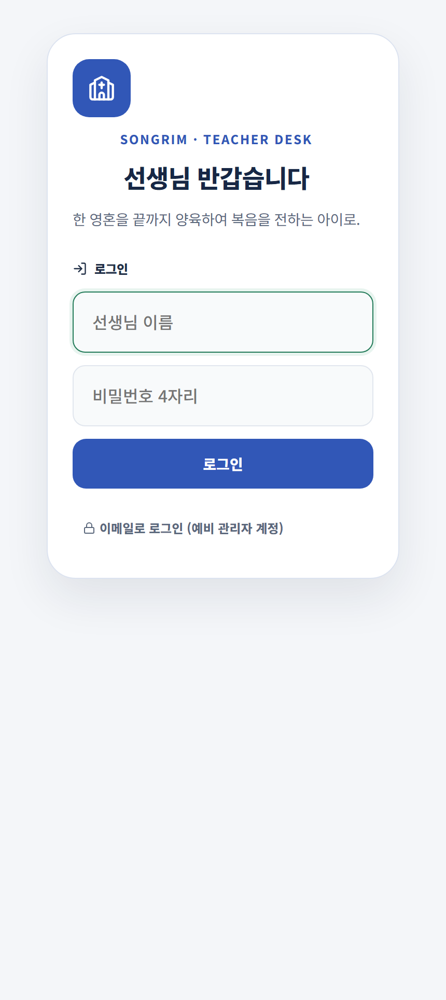

# 선생님 5분 시작하기

선생님은 송림소년부 출석부 안에서 출석과 JoyGrow 칭찬을 함께 기록합니다.

## 주일 운영 순서

1. **로그인** — 출석부에서 이름과 숫자 4자리 비밀번호를 입력합니다.
2. **출석 기록** — 하단 `출석`에서 출석·어묵·재량을 확인합니다.
3. **칭찬 발견** — 예배와 반 모임 중 실제 좋은 행동을 살펴봅니다.
4. **JoyGrow 기록** — 하단 `JoyGrow`에서 해당 학생과 칭찬 버튼을 누릅니다.
5. **마무리 확인** — 지급 완료 문구와 최근 기록을 확인합니다.

## 가장 자주 쓰는 메뉴

| 메뉴 | 언제 사용하나요? |
|---|---|
| 홈 | 오늘 할 일과 담당 반 상태 확인 |
| 출석 | 출석·어묵·재량 기록, 성장 포인트 일괄 입력 |
| JoyGrow | 학생별 칭찬, 챈트, 친구 전도 기록 |
| 통계 | 담당 반 출석 흐름 확인 |
| 심방요청 | 돌봄이 필요한 상황 전달 |

> **기억하세요**  
> 학생이 점수를 요구해서 주는 것이 아니라, 선생님이 **직접 확인한 행동**을 구체적으로 칭찬하며 기록합니다.
