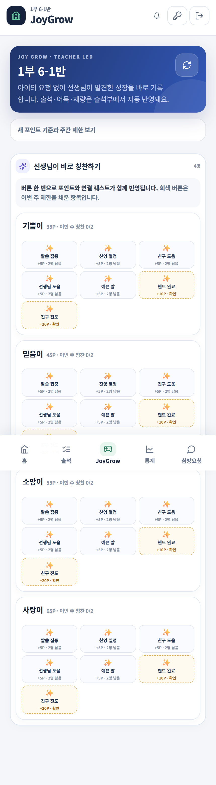

# 포인트 기준표

## 자동으로 들어가는 항목

| 출석부 기록   |           보상 |
| -------- | -----------: |
| 예배 출석    | 10P + 30 EXP |
| 어묵 1\~3회 |  6P + 12 EXP |
| 어묵 4\~6회 |  9P + 18 EXP |
| 재량       |  3P + 10 EXP |

## 선생님이 직접 기록하는 항목

| 버튼     | 확인 기준                   |            보상 |
| ------ | ----------------------- | ------------: |
| 말씀 집중  | 말씀과 반 모임에 귀 기울임         |   5P + 15 EXP |
| 찬양 열심히 | 찬양에 기쁘게 참여함             |   5P + 15 EXP |
| 친구 도움  | 도움이 필요한 친구를 도와줌         |   5P + 15 EXP |
| 선생님 도움 | 준비와 정리를 함께 도움           |   5P + 15 EXP |
| 챈트     | 그달 챈트를 노래하거나 말로 외워 확인받음 |  20P + 20 EXP |
| 친구 전도  | 새가족 등록과 실제 예배 출석을 확인함   | 100P + 50 EXP |

## 일반 칭찬 제한

말씀 집중, 찬양 열심히, 친구 도움, 선생님 도움에 적용됩니다.

* 학생 1명당 네 항목을 합쳐 주 2개까지
* 같은 항목은 반 정원의 30%(올림)까지
* 같은 학생에게 같은 항목은 주 1회

`2명 남음`, `2개 완료`, `반 3명 완료`, `이번 주 완료` 문구가 현재 상태를 알려 줍니다.

## 잘못 기록했을 때

출석 화면의 최근 지급 기록에서 취소 버튼이 있는 기록만 취소합니다. 같은 항목을 다시 누르기 전에 저장·연결 상태부터 확인하세요.

> 화면에 표시되는 현재 제한과 보상 값이 최종 기준입니다.
